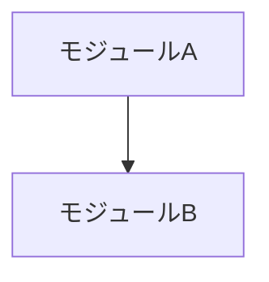

# コード構成（As-Is）

> **本書はコードベース調査から生成された AS-IS ドキュメントです（00_analyze）**
>
> | 項目 | 内容 |
> | -- | -- |
> | 生成日 | YYYY-MM-DD |
> | 対象コミット | `abc1234` |
> | 対象ブランチ | main |
> | 信頼度凡例 | [確認済] / [推定] / [不明] |

## 1. ディレクトリ構成

<!-- 深さ2〜3。vendor / node_modules / 自動生成物は除外し、各ディレクトリの役割を1行で。 -->

```text
├── app/            # 
├── config/         # 
└── ...
```

## 2. アーキテクチャパターン

| 項目 | 内容 | 根拠 |
| -- | -- | -- |
| 採用パターン | （例）レイヤード MVC [確認済] | Controller/Service/Repository の基底クラス構成 |
| レイヤ間の依存規律 | （例）Controller → Service → Repository。逆流箇所あり [確認済] | |
| 例外・逸脱 | （例）一部 Controller が直接 DB アクセス | 該当ファイル列挙 |

## 3. モジュール依存概要



<!-- 厳密な全依存でなく主要な流れ。循環依存を発見したら明記し DEBT に記録。 -->

## 4. 横断的関心事の実装方式

| 関心事 | 実装方式 | 実装位置（根拠） |
| -- | -- | -- |
| 認証 | | |
| 認可・権限 | | |
| トランザクション境界 | | |
| エラーハンドリング | | |
| ロギング | | |
| バリデーション | | |
| 設定管理 | | |

## 5. 観察された規約

<!-- feature-constitution の入力になる。「明文化されていないが守られているルール」を書く。 -->

| 分類 | 規約（観察結果） | 遵守度 | 根拠 |
| -- | -- | -- | -- |
| 命名 | | 高/中/低 | |
| ファイル配置 | | | |
| テストの書き方 | | | |
| エラー処理 | | | |
