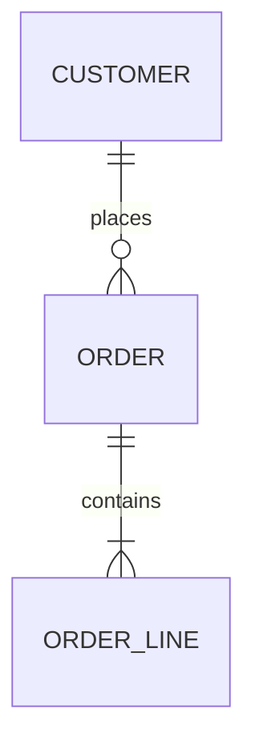

# データ概要（As-Is）

> **本書はコードベース調査から生成された AS-IS ドキュメントです（00_analyze）**
>
> | 項目 | 内容 |
> | -- | -- |
> | 生成日 | YYYY-MM-DD |
> | 対象コミット | `abc1234` |
> | 対象ブランチ | main |
> | 信頼度凡例 | [確認済] / [推定] / [不明] |

## 1. データストア一覧

| ストア | 種別 | 用途 | 定義の根拠 |
| -- | -- | -- | -- |
| （例）主 DB | PostgreSQL 15 | 業務データ | docker-compose.yml, config/database.php |
| （例）Redis | KVS | セッション・キャッシュ | |

## 2. テーブル一覧

<!-- 定義根拠はマイグレーション/DDL を優先。ORM モデルのみから推定した場合は [推定] を付ける。 -->

| テーブル | 役割（1行） | 主キー | 主な外部キー / 関連 | 対応モデル | 定義根拠 |
| -- | -- | -- | -- | -- | -- |

## 3. 主要エンティティの ER 概要

<!-- 全テーブルでなく、業務の背骨になる10〜20テーブルに絞る。 -->

## 4. 横断的なデータパターン

| パターン | 有無 | 実装方式 | 根拠 |
| -- | -- | -- | -- |
| 論理削除 | | | |
| 監査列（created_by 等） | | | |
| 楽観ロック | | | |
| マルチテナント分離 | | | |
| 個人情報の格納箇所 | | | |

## 5. 所見・リスク

<!-- スキーマとモデルの食い違い、外部キー制約の欠如、命名の揺れなど。DEBT に採番して 07 の台帳へ。 -->

| 所見 | 影響 | 関連 DEBT |
| -- | -- | -- |
