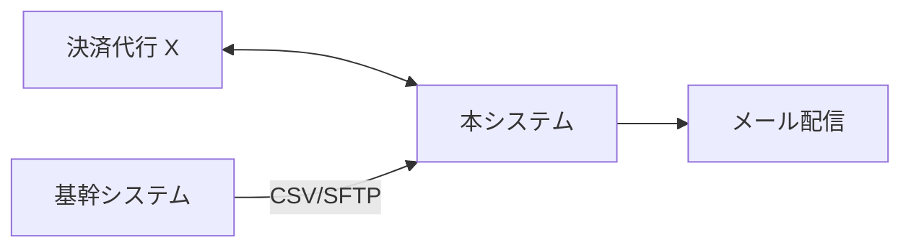

# 外部連携一覧（As-Is）

> **本書はコードベース調査から生成された AS-IS ドキュメントです（00_analyze）**
>
> | 項目 | 内容 |
> | -- | -- |
> | 生成日 | YYYY-MM-DD |
> | 対象コミット | `abc1234` |
> | 対象ブランチ | main |
> | 信頼度凡例 | [確認済] / [推定] / [不明] |

## 1. 外部連携一覧

| EXT ID | 連携先 | 方向 | 方式 | 認証 | 用途 | 実装位置（根拠） | 障害時の挙動 |
| -- | -- | -- | -- | -- | -- | -- | -- |
| EXT-001 | （例）決済代行 X | 送信 | REST API | API キー | 決済処理 | `app/Services/PaymentService.php` | リトライ3回 [確認済] |
| EXT-002 | （例）基幹システム | 受信 | SFTP（CSV） | 鍵認証 | 商品マスタ取込 | EP-005（バッチ） | [不明 → UNK-xxx] |

方向: `送信` / `受信` / `双方向`
方式: `REST` / `SOAP` / `SFTP・ファイル` / `メッセージング` / `DB 直接参照` / `その他`

## 2. 連携全体図

## 3. 連携ごとの特記事項

<!-- リトライ・冪等性・タイムアウト・レート制限・データ量など、追加開発時に壊しやすいポイントを EXT ごとに。 -->

### EXT-001: 連携先名

- タイミング / 頻度:
- データ量の目安:
- 冪等性・重複防止:
- 特記事項:

## 4. 所見・リスク

| 所見 | 影響 | 関連 DEBT / UNK |
| -- | -- | -- |
