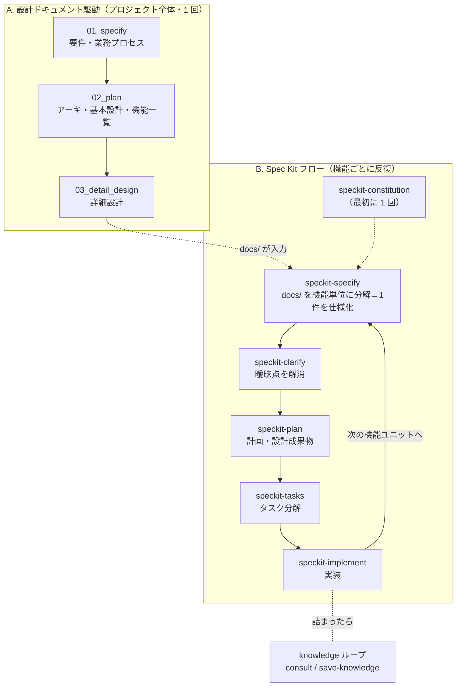

# 開発スキル活用ガイド

このリポジトリには、Claude Code で**設計から実装までを一貫して進めるためのスキル群**が同梱されています。
本ドキュメントは「開発のどの段階で、どのスキルを、どう使うか」を説明します。

---

## 1. スキルの全体像

スキルは大きく **2 系統 + 補助** に分かれます。

### A. 設計ドキュメント駆動（プロジェクト全体の設計）

日本語での対話・確認ゲート方式で、**プロジェクト全体の設計書**を段階的に作ります。
成果物はすべて `docs/` 配下に出力され、上流→下流のトレーサビリティ（ID 紐付け）を担保します。

| 順 | スキル | 役割 | 主な成果物 |
|----|--------|------|-----------|
| 1 | `01_specify` | 要件定義・業務プロセス整理 | `docs/01_Project_Design/01_Requirements.md`, `02_Business_Process.md` |
| 2 | `02_plan` | アーキテクチャ・基本設計・機能一覧 | `docs/01_Project_Design/03_Architecture.md`, `04_Basic_Design.md`, `05_Feature_List.md` |
| 3 | `03_detail_design` | データ/画面/IF/モジュールの詳細設計 | `docs/02_Detailed_Design/**`（テーブル・画面・IF・モジュール別ファイル） |

### B. Spec Kit フロー（機能単位の仕様→実装）

GitHub Spec Kit ベースの反復型フロー。**1 回の実行につき 1 機能ユニット**を、
仕様 → 明確化 → 計画 → タスク → 実装まで回します。成果物は `specs/<feature>/` 配下。

| 順 | スキル | 役割 | 主な成果物 |
|----|--------|------|-----------|
| 0 | `speckit-constitution` | プロジェクト憲章（原則・ガバナンス）の作成/更新 | `.specify/memory/constitution.md` |
| 1 | `speckit-specify` | 機能仕様書の作成（`docs/` を機能単位に分解して 1 件を仕様化） | `specs/<feature>/spec.md`, `specs/backlog.md` |
| 2 | `speckit-clarify` | 仕様の曖昧点を最大 5 問で解消し仕様に反映 | `spec.md`（更新） |
| 3 | `speckit-plan` | 実装計画・設計成果物の生成 | `plan.md`, `research.md`, `data-model.md`, `contracts/`, `quickstart.md` |
| 4 | `speckit-tasks` | 依存順に並んだ実行可能タスク一覧の生成 | `tasks.md` |
| 5 | `speckit-implement` | `tasks.md` を実行して実装 | ソースコード変更 |
| — | `speckit-agent-context-update` | `CLAUDE.md` 等のエージェント文脈を現機能の計画に更新（`plan` から自動呼出） | `CLAUDE.md` の管理ブロック |

### 補助スキル（フロー全体で随時）

| スキル | 役割 |
|--------|------|
| `consult-knowledge` | トラブル発生時に `knowledge/` の過去事例を検索して既知の解決策を再利用（**発生時に自動発火**） |
| `save-knowledge` | 解決したトラブルを構造化して `knowledge/` に記録 |
| `implement` | 実装計画書を入力に「タスク分解→実装→起動→Playwright で動作確認」まで行う汎用実装スキル |
| `update-skill` | 既存スキルを安全に更新 |

---

## 2. 2 系統はどうつながるか

`01_specify` → `02_plan` → `03_detail_design` が `docs/` にプロジェクト全体の設計を作り、
`speckit-specify` がその `docs/` を**機能ユニットに分解**して 1 件ずつ Spec Kit フローに載せます。



> **ポイント**: A で作った `docs/` は「プロジェクト全体像」、B の `specs/<feature>/` は「その中の 1 機能の実装仕様」。
> `speckit-specify` は `specs/backlog.md` に機能ユニットの一覧と進捗（Spec/Plan/Tasks/Implement）を管理し、1 件ずつ消化していきます。

---

## 3. 使い分け：どのフローで進めるか

| 状況 | 推奨アプローチ |
|------|----------------|
| 新規プロジェクトを設計から立ち上げる | **A → B**。まず `01_specify`〜`03_detail_design` で全体設計、その後 `speckit-*` で機能ごとに実装 |
| 単発の機能追加・改修 | **B のみ**。`speckit-specify` に機能を直接説明して仕様化から開始（`docs/` が無くても自然言語入力で動く） |
| 全体設計だけ整えたい（実装はまだ） | **A のみ**（`01`〜`03`） |
| 既に実装計画書がある | `implement` スキルで直接実装（起動 + Playwright 確認まで自動） |
| 実装中にエラー・起動失敗などで詰まった | `consult-knowledge`（自動発火）→ 解決したら `save-knowledge` |

---

## 4. 各スキルの使い方（要点）

### A 系統：設計ドキュメント駆動

いずれも**フェーズ制・確認ゲート方式**。各フェーズ末尾で `AskUserQuestion` により合意を取り、
勝手に次へ進みません。テンプレートはスキル同梱の `references/templates/` を使い、出力は `docs/` 配下のみ。

- **`01_specify`** — 「要件定義をしたい」「仕様化して」で起動。
  不明点は必ず質問、軽微な点は `ASSUMPTION` で仮置き。`BP/BRL/EX → BREQ → FR → AC` のトレーサビリティを ID で管理。
  フェーズ 0（セットアップ）〜7（最終レビュー）。`scripts/check_traceability.py` で機械チェック。
- **`02_plan`** — 「アーキテクチャ設計をして」「機能一覧を作って」で起動。
  入力は `01_Requirements.md` と `02_Business_Process.md`（無ければ中断して先に要件定義を提案）。
  技術選定は **ADR 形式**で根拠を記録、図は **Mermaid**。`FNC/SCR/RPT/IF/BAT` の ID を採番して詳細設計へ橋渡し。
- **`03_detail_design`** — 「詳細設計を作って」「テーブル定義を書いて」で起動。
  入力は `05_Feature_List.md` ほか。**データ→画面→外部IF→モジュール**の順で、
  各カテゴリの共通仕様（`00_*_Common.md`）を先に作ってから個別ファイル（1 テーブル/画面 = 1 ファイル）を作成。

### B 系統：Spec Kit フロー

- **`speckit-constitution`**（最初に 1 回）— プロジェクトの原則・ガバナンスを `.specify/memory/constitution.md` に定義。
  以降の spec/plan/tasks はこの憲章に整合するよう検証されます。
- **`speckit-specify`** — 2 モードで動作。
  - *Mode A*: 機能を指定せず起動 → `docs/` を走査して機能ユニットを抽出、`specs/backlog.md` に一覧化 → どれを仕様化するか質問。
  - *Mode B*: 機能を指定（または A で選択）→ その 1 機能の `spec.md` を作成し、品質チェックリストで検証。
  - **WHAT/WHY に集中**（実装技術＝HOW は書かない）。曖昧点は最大 3 個の `[NEEDS CLARIFICATION]` まで。
- **`speckit-clarify`** — `speckit-plan` の**前に**実行推奨。最大 5 問の的を絞った質問で仕様の曖昧さを潰し、
  回答を `## Clarifications` セクションと該当箇所へ反映。
- **`speckit-plan`** — 実装計画を生成。`spec.md` + 憲章 + （記録された）`docs/` を読み、
  Constitution Check ゲートを評価し、Phase 0（research）→ Phase 1（data-model/contracts/quickstart）を実行。
  最後に `speckit-agent-context-update` を呼んで `CLAUDE.md` を更新。**`tasks.md` はここでは作らない**。
- **`speckit-tasks`** — 設計成果物から依存順の `tasks.md` を生成。
- **`speckit-implement`** — `tasks.md` を実行。**Opus がオーケストレータ、Sonnet サブエージェントが実装**を担当し、
  タスク単位で実装→レビュー→完了マーク（`[X]`）を進める。

---

## 5. 典型的な開発シナリオ（例）

新規プロジェクトを立ち上げ、最初の機能まで実装する流れ:

```text
1. /01_specify            → 要件定義・業務プロセスを対話で確定（docs/01_Project_Design/）
2. /02_plan               → アーキ・基本設計・機能一覧を作成（同上）
3. /03_detail_design      → 詳細設計を作成（docs/02_Detailed_Design/）
   ─────────────── ここまででプロジェクト全体の設計が揃う ───────────────
4. /speckit-constitution  → プロジェクト憲章を 1 回定義
5. /speckit-specify       → docs/ を機能単位に分解、backlog から 1 件を仕様化
6. /speckit-clarify       → その機能の曖昧点を解消
7. /speckit-plan          → 実装計画・設計成果物を生成
8. /speckit-tasks         → tasks.md を生成
9. /speckit-implement     → 実装
   → 次の機能は 5 に戻って繰り返し（backlog の進捗が更新される）

※ 途中でエラーに詰まったら consult-knowledge が自動で過去事例を検索。
　 解決したら save-knowledge で記録し、次回以降に再利用。
```

単発の機能追加なら **4〜9 だけ**（`docs/` が無くても `speckit-specify` に機能を直接説明すればよい）。

---

## 6. 共通の約束ごと

- **確認ゲートを飛ばさない**: A 系統は各フェーズで合意を取ってから次へ進む。
- **トレーサビリティを維持**: 上流 ID（要件・機能一覧）と下流成果物を必ず紐付ける。機械チェックスクリプトを活用。
- **推測で確定しない**: 重要な不明点は質問、軽微なら `ASSUMPTION`/`TBD` として明示する。
- **テンプレートは同梱物を使い、本体は編集しない**: 各スキルの `references/templates/` は読み取り専用。出力は `docs/` や `specs/` へ。
- **リモート操作はしない**: コミット・PR・プッシュはユーザ依頼が無い限り行わない。
- **スキルの起動**: `/<スキル名>`（例: `/01_specify`, `/speckit-plan`）で呼び出す。`consult-knowledge` はトラブル時に自動発火。

---

## 7. 参考

- 各スキルの詳細: `.claude/skills/<スキル名>/SKILL.md`
- ナレッジループの仕組み: `knowledge/README.md`
- 導入方法・オプション: リポジトリ直下の `README.md`
